  <!-- Custom Hand-Crafted Cyberpunk Animated Banner -->
  

    

  <!-- Dynamic Typing Monospace SVG -->
  

    

  <!-- High-Tech Quick Access Badges -->
  

    
    &nbsp;
    
    &nbsp;
    
    &nbsp;
    
  

 

<!-- Interactive Cyber Terminal HUD -->

  

 

---

### Core Engineering Arsenal

  

 

| Domain | Systems & Frameworks |
| :--- | :--- |
| **Languages** | TypeScript, JavaScript (ESNext), Solidity, Rust, Python, SQL |
| **Interface Architecture** | Next.js, React, TailwindCSS, WebSocket Stream Consumers, Real-time State |
| **Backend & Distributed** | Node.js, Express, REST APIs, GraphQL, Event Streams, Microservices |
| **Web3 & Cryptography** | Ed25519 Signatures, HTLC / PTLC Deal Engines, Smart Contracts, Ethers.js, Viem |
| **Infrastructure & CI/CD** | Docker, Linux Environments, GitHub Actions, Vercel, Edge Networks |
| **Security & Verification** | Vitest, Jest, Unit & Integration Pipelines, Protocol Security Auditing |

---

### Featured Protocols & Systems

| System | Architecture & Focus | Stack | Repository |
| :--- | :--- | :--- | :---: |
| **Technocore Console** | Client-side control panel & Ed25519 identity console for the Technocore agent chat protocol | `JS` `Ed25519` `WebSockets` | [**Access Console**](https://github.com/Asadlee24/technocore-console) |
| **Technocore Explorer** | Real-time network telemetry observer & activity dashboard for autonomous agent clusters | `TypeScript` `React` `APIs` | [**Access Explorer**](https://github.com/Asadlee24/technocore-explorer) |
| **TCLK Deal Engine** | Cryptographic HTLC/PTLC settlement protocol enabling chat agents to lock, verify, and settle trustlessly | `TypeScript` `HTLC/PTLC` `Crypto` | [**Access Protocol**](https://github.com/Asadlee24/tclk) |
| **Arcshift USDC Bridge** | High-efficiency cross-chain liquidity router & settlement rail for stable asset transit | `TypeScript` `Web3` `EVM` | [**Access Bridge**](https://github.com/Asadlee24/arcshift-usdc-bridge) |
| **Warp Transfer** | Lightweight transaction dispatch pipeline engineered for low-latency distributed micro-settlements | `JavaScript` `P2P` `Protocol` | [**Access Rail**](https://github.com/Asadlee24/warp-transfer) |

---

### Activity & Repository Metrics

  <table border="0">
    <tr>
      <td width="50%">
        
      </td>
      <td width="50%">
        
      </td>
    </tr>
    <tr>
      <td colspan="2" align="center">
        
      </td>
    </tr>
  </table>

---

### Contribution Matrix

  <picture>
    <source media="(prefers-color-scheme: dark)" srcset="https://raw.githubusercontent.com/Asadlee24/Asadlee24/output/github-contribution-grid-snake-dark.svg">
    <source media="(prefers-color-scheme: light)" srcset="https://raw.githubusercontent.com/Asadlee24/Asadlee24/output/github-contribution-grid-snake.svg">
    
  </picture>

---

  ### Transmission & Network

  
  &nbsp;
  
  &nbsp;
  

    

  Engineered by <b>Asad Lee</b> • All systems decentralized, open-source &amp; verifiable

    

  <!-- Clean Footer Wave -->
  

